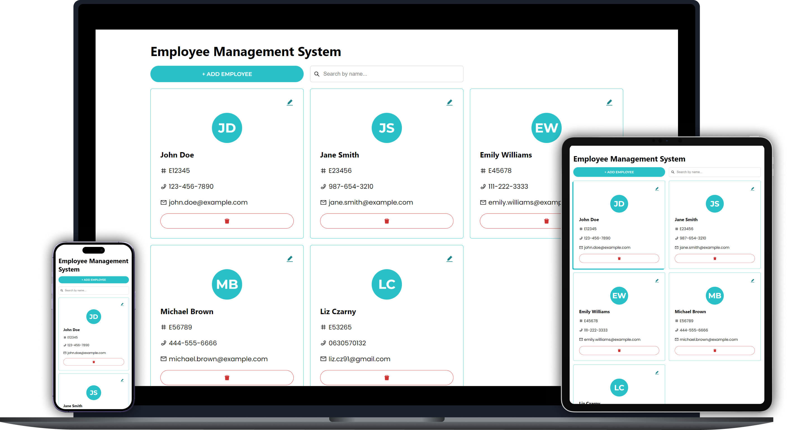
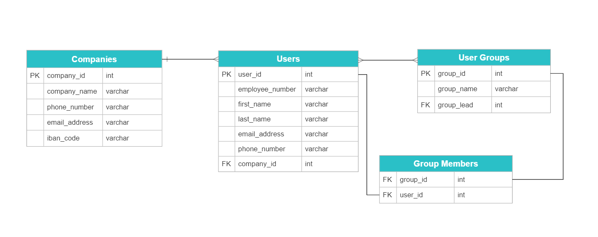

# Employee Management App

The Employee Management App is a web application that allows you to manage employee information, including adding, editing, and deleting employees. It provides a user-friendly interface for interacting with the employee data.

<p align="center">
	
</p>

## Database Design

<p align="center">
	
</p>

## Features

- View a list of employees with their details.
- Add new employees to the system via a modal dialog.
- Edit existing employee information via a modal dialog.
- Delete employees from the system.
- Search by employee name.

## Technologies Used

- React: JavaScript library for building user interfaces.
- LocalStorage: Web API for storing data in the browser.
- React Icons: Library for adding icons to the application.
- CSS: Styling the application components.

## Getting Started

### Prerequisites

- Node.js: Make sure you have Node.js installed on your system.

### Installation

1. Clone the repository:

   ```shell
   git clone https://github.com/Elizabeth-Cz/home-assignment.git

   ```

2. Navigate to the project directory:

   ```shell
   cd home-assignment/client
   ```

3. Install the dependencies:

   ```shell
   npm start
   ```

5.Open your browser and visit http://localhost:3000 to access the application.

## Usage

- Upon launching the application, you will see a list of employees.
- Use the "Add Employee" button to add a new employee.
- Click on the edit icon to modify an existing employee's information.
- Click on the delete icon to remove an employee from the system.
- Use the search bar at the top to filter employees by name.

## Thank you
